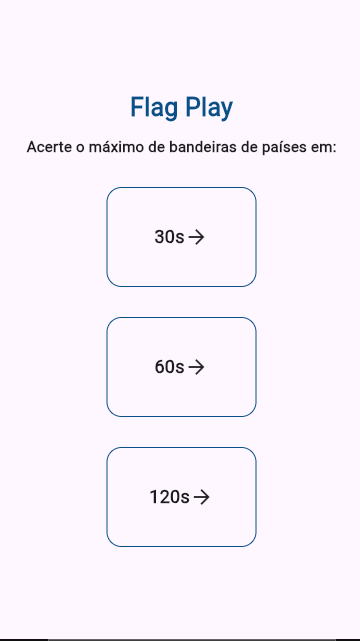
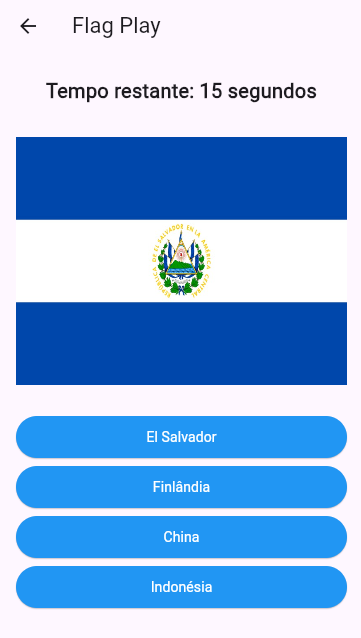
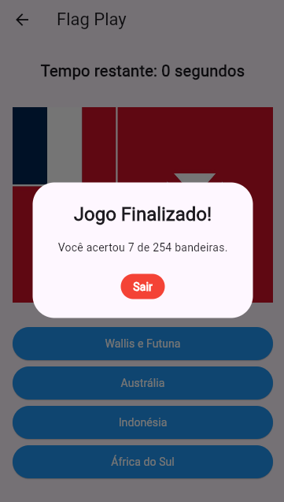

# Flag Play

#### Este é um projeto desenvolvido em Flutter com o objetivo de criar um jogo educativo que desafia você a identificar bandeiras de diferentes países de forma divertida e interativa. As perguntas são aleatórias e acompanhadas de feedback visual imediato para respostas corretas ou incorretas, tornando a experiência mais dinâmica. Ao final, o jogo exibe sua pontuação total, permitindo que você acompanhe seu progresso enquanto aprende mais sobre as bandeiras do mundo.

  
  
  

